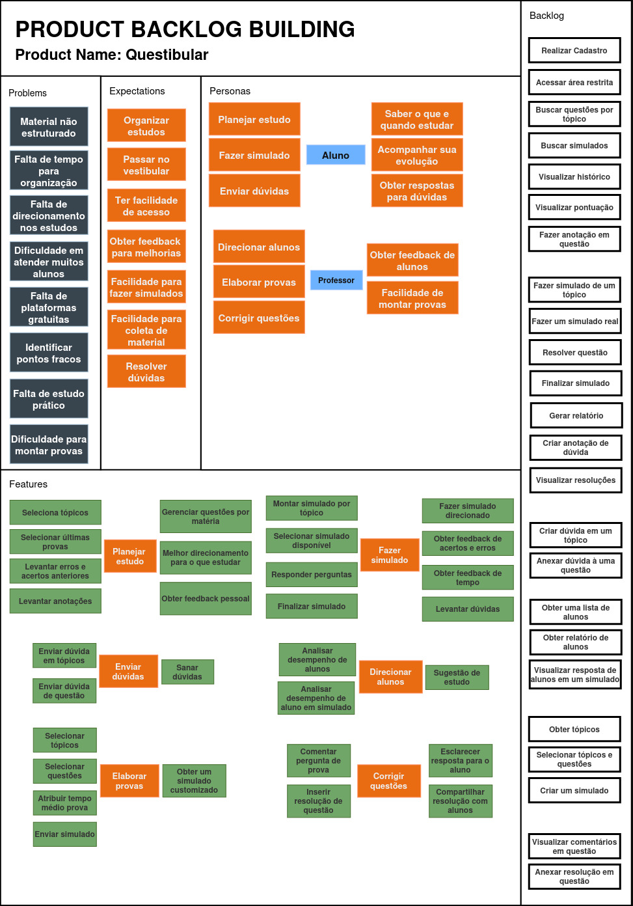

[Voltar](./README.md)

# Product Backlog Building (PBB)

Para a construção do PBB, foi aplicada uma dinâmica de grupo na qual o integrante **Yago** assumiu o papel de Product Owner (PO), conduzindo a reunião, enquanto os demais integrantes — **Caio**, **Ísis**, **Leonardo** e **Rodrigo** — atuaram como desenvolvedores. A equipe conduziu a reunião de forma horizontal, levantando questionamentos técnicos e, ao mesmo tempo, buscando exercer o papel de cliente/usuário do sistema a fim de compreender melhor as necessidades. Como resultado desse processo, foram obtidas as features e o backlog apresentados na imagem abaixo.

## PBIs STEP MAP

[Em construção]